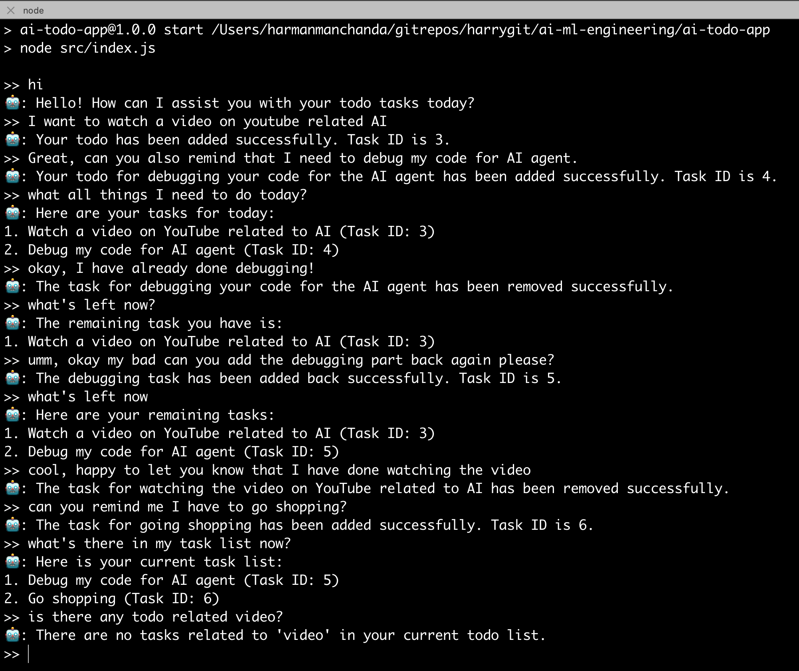
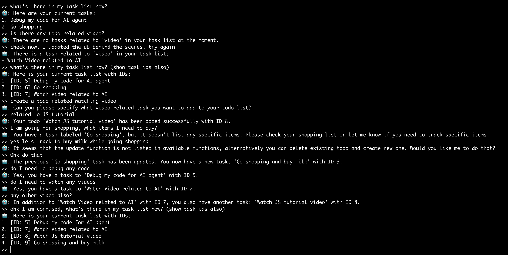
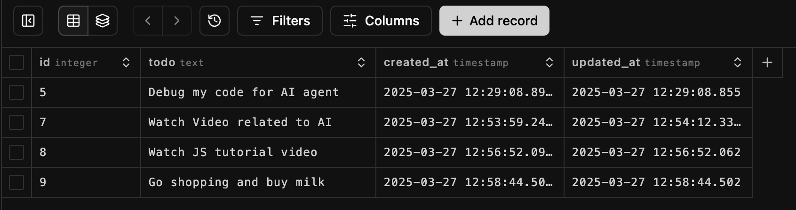

# AI Todo App (Task List App)

This is a simple AI Todo App (Task List App) that uses the text inputs to perform the following actions:

- Add a task
- Delete a task
- Show all tasks
- Search for a task

It also updates tasks by deleting record and adding new record if the task already exists provided you mention that you are looking to do this. We could have wrote an algorithm to update the task but we wanted to let AI do the work for us instead.

## Demo

